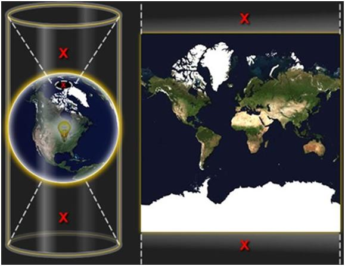
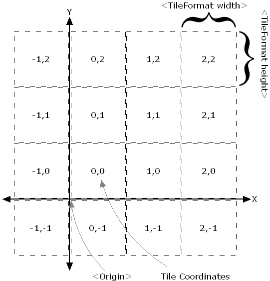
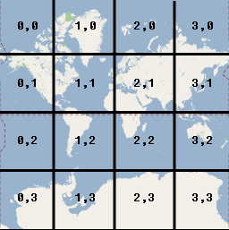

## 一、Google地图切片的投影方式及瓦片索引机制

1.Google地图采用的是Web墨卡托投影（如下图），为了方便忽略了两极变形较大的地区，
把世界地图做成了一个边长等于赤道周长的正方形（赤道长度为6378137米），原点在正方形中心，
即经纬度为（0,0）处。Web墨卡托投影的X，Y坐标取值范围为：[-20037508.3427892,20037508.3427892]，
对应的经度取值范围为[-180,180]，对应的纬度范围则为[-85.05112877980659，85.05112877980659]。
具体投影解释请参考 [墨卡托投影](http://blog.csdn.net/mygisforum/article/details/13295223)：

 

2.Google 地图的索引机制是 [TMS(Tile Map Service)](http://wiki.osgeo.org/wiki/Tile_Map_Service_Specification) 
规范的一个变种，其地图瓦片如下图进行索引：

**Google 瓦片坐标系**：把地球投影后形成的正方形划分为2 的 level(缩放级别) 次幂个地图瓦片，原点在左上角，
类似于像素坐标系；详细解释参见Google Maps API 文档。

 

**TMS瓦片坐标系**：TMS与Google的地图瓦片切割方法相同，不同的是TMS的原点在左下角。

**转换关系**：TMS 与Google 坐标系的X 、Z是相等的，Y 的转换关系为：
Y(TMS) +  Y(Google) = Math.pow(2，zoom) - 1

3.地图缩放级别的分辨率与地图比例尺的关系

地图缩放级别的分辨率（Resolution），是指某缩放级别每个像素代表的实际距离；
地图比例尺(Scale)，是指某缩放级别图上一米代表的实际距离；
默认使用屏幕分辨率为96  
算法：  
dpi=96，即表示每英寸96像素，1英寸=2.54厘米。  
比例尺与分辨率的关系：Scale=Resolution×每米的像素个数，  
即有Scale = Resolution×(96*100)/2.54  
则Resolution = Scale*2.54/(96*100)  