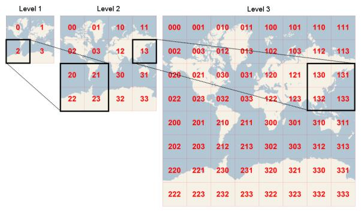

##OpenStreetMap/Google/百度/Bing瓦片地图服务(TMS)

开源与成熟商业的瓦片地图服务（TMS  2  WMTS），都有如下共同的特性，基本成为了标准：

(1) 坐标系：WGS84

(2) 投影：墨卡托投影（Marcator，正轴等角圆柱投影）

--------------------------------------------

注：λ、φ 均为弧度。
(3) 当经度范围在[-180,180]，投影为正方形时，纬度范围：[-85.05113, 85.05113]

(4) 图片大小：256*256

(5) 图片格式：jpg[有损压缩率高、不透明]   png[无损、透明]

> OpenStreetMap   格式：png

(1,0,0)    (1,1,0)

(1,0,1)    (1,1,1)

瓦片地址格式：http://a.tile.openstreetmap.org/9/420/193.png

Cycle Map：http://c.tile.opencyclemap.org/cycle/9/420/193.png

Transport Map：http://b.tile2.opencyclemap.org/transport/9/420/193.png

MapQuest Map：http://otile3.mqcdn.com/tiles/1.0.0/osm/9/420/193.png

z: [0-18]    x,y: [0-]

在第z级别，x,y方向的瓦片个数均为：

图片（z,x,y）像素（m,n）[注：像素坐标以左上角为原点，x轴向右，y轴向下]的经纬度[单位：度]分别为：

----------------------------------------------------------------------------
已知经纬度(单位：度)，求瓦片编号x,y：

> Google Map  卫星地图/地形图：jpg   地图：png

(0,0,1)    (1,0,1)

(0,1,1)    (1,1,1)

瓦片地址格式：http://mt2.google.cn/vt/lyrs=m@167000000&hl=zh-CN&gl=cn&x=420&y=193&z=9 

z: [0-18]    x,y: [0-]

地图图层说明：

h skeleton map light  http://mt2.google.cn/vt/lyrs=h&hl=zh-CN&gl=cn&x=420&y=193&z=9

m 全地图   http://mt2.google.cn/vt/lyrs=m&hl=zh-CN&gl=cn&x=420&y=193&z=9

p terrain+map  http://mt2.google.cn/vt/lyrs=p&hl=zh-CN&gl=cn&x=420&y=193&z=9

r skeleton map dark   http://mt2.google.cn/vt/lyrs=r&hl=zh-CN&gl=cn&x=420&y=193&z=9

y hybrid satellite map   http://mt1.google.cn/vt/lyrs=y&hl=zh-CN&gl=cn&x=420&y=193&z=9

t 地形图   http://mt0.google.cn/vt/lyrs=t&hl=zh-CN&gl=cn&x=420&y=193&z=9

s 卫星地图   http://mt3.google.cn/vt/lyrs=s&hl=zh-CN&gl=cn&x=420&y=193&z=9

也可以进行组合，例如：s,r 或者 t,h   http://mt3.google.cn/vt/lyrs=t,h&hl=zh-CN&gl=cn&x=420&y=193&z=9

图片（x,y,z）像素（m,n）[注：像素坐标以左上角为原点，x轴向右，y轴向下]的经纬度[单位：度]与openmapstreet方法一致。

> Bing Map   格式：png

  0    1

  2    3

瓦片地址格式：http://r1.tiles.ditu.live.com/tiles/r132122232001311321.png?g=100&mkt=zh-cn

级数：[1-18] 

> Baidu Map  格式：jpg、png

(0,0,3)      (1,0,3)

(0,M1,3)    (1,M1,3)

瓦片地址格式：http://shangetu1.map.bdimg.com/it/u=x=99092;y=19997;z=19;v=017;type=web&fm=44&udt=20130712 

百度地图赤道上的分辨率为：218-z米/像素

z: [3-19]    x,y: 注：其中R为地球半径（R=6378137）

在第z级别，x,y方向的瓦片个数均为：

地图图层说明：

type=web 地图   http://shangetu0.map.bdimg.com/it/u=x=101237;y=37702;z=19;v=017;type=web&fm=44&udt=20130712

type=sate 卫星图  http://shangetu1.map.bdimg.com/it/u=x=101237;y=37702;z=19;v=009;type=sate&fm=46&udt=20130506

路网：http://online0.map.bdimg.com/tile/?qt=tile&x=101237&y=37702&z=19&styles=sl&v=017&udt=20130712

实时交通信息：http://its.map.baidu.com:8002/traffic/TrafficTileService?level=19&x=99052&y=20189&time=1373790856265&label=web2D&v=017

三维：http://d3.map.baidu.com/resource/mappic/bj/2/3/lv2/1251,1143.jpg?v=001  【z: [lv6-lv1]】

(lv6,76,70)    (lv6,77,70)

(lv6,76,71)    (lv6,77,71)

图片（x,y,z）像素（m,n）[注：像素坐标以左上角为原点，x轴向右，y轴向下]的经纬度[单位：度]分别为：

-----------------------------------------------------------------------------

已知经纬度(单位：度)，求瓦片编号x,y：

>瓦片下载工具

1.太乐地图：ArcTilerDesktopV3.5.rar，http://www.arctiler.com/

2.全能电子地图下载器：MapTileDownloader1.8.3.exe，http://code.google.com/p/maptiledownloader/

3.TileDownloader: http://www.softpedia.com/progDownload/Tile-Downloader-Download-198232.html

http://sourceforge.net/projects/tiledownloader/files/1.3/release1.3-bin.zip/download

>坐标转换工具

http://rovertang.com/labs/tileindex/

http://rovertang.com/archives/545

http://rovertang.com/labs/GMAPIv3_Offline/

公式&代码实现：http://wiki.openstreetmap.org/wiki/Slippy_map_tilenames

