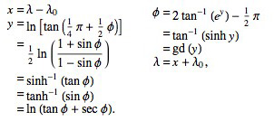

## 一、墨卡托投影

**墨卡托投影**，又称正轴等角圆柱投影，由荷兰地图学家墨卡托(G.Mercator)于1569年创拟。
假设地球被套在一个圆柱中，赤道与圆柱相切，然后在地球中心放一盏灯，把球面上的图形投影到圆柱体上，
再把圆柱体展开，就形成以一幅墨卡托投影的世界地图（如下图）。因其等角特性，广泛应用与航空、航海中。

从上图中可以看出，X轴的刻度是等距的，Y轴方向越靠近两极变形越大。
假设墨卡托投影的坐标系原点为(0，λ0) ，
表示X轴为赤道，Y轴则在经度为λ0处垂直于赤道。 墨卡托投影公式即为：

 

其中，λ 为经度， φ 为纬度。左侧为正算，右侧为逆运算。
即有经纬度（λ，φ）对应的墨卡托平面坐标即为（x*R，y*R）。很明显，y方向的距离只有在赤道附近才是接近实际距离的。

## 二、Web墨卡托投影

**Web墨卡托投影坐标系**，广泛应用与Google Map、Bing Map等地图投影中。
它以整个世界范围，赤道作为标准纬线，本初子午线作为中央经线，两者交点为坐标原点，向东向北为正，向西向南为负。

X轴：赤道半径取值为**6378137**米，则赤道周长为2*PI*r ，以坐标原点为中心，
东西南北各方向为其值一半，即 PI*r= 20037508.3427892，
因此X轴的取值范围：[-20037508.3427892,20037508.3427892]。

Y轴：由墨卡托投影的公式可知，当纬度φ接近两极，即90°时，y值趋向于无穷。
为了使用方便，就把Y轴的取值范围也限定在[-20037508.3427892,20037508.3427892]之间，形成一个正方形。

因此在投影坐标系（米）下的范围是：最小(-20037508.3427892, -20037508.3427892 )
到最大 (20037508.3427892, 20037508.3427892)。经过反算，可得到纬度85.05112877980659。
因此纬度取值范围是[-85.05112877980659，85.05112877980659]。

## 三、网络地图投影参数

Global Spherical Mercator —— Main parameters:

| Datum        | WGS84           |   |
| ------------- |:-------------:| -----|
| Map projection      | Spherical Mercator |  |
| Ellipsoid     | 	WGS84      |    |
| EPSG Code | EPSG: 4326    |    (for coordinates in latitude/longitude) |
| EPSG Code | EPSG: 900913   |   (for coordinates in metres)|

正因为采用了相同的地图投影才使得不同地图服务商的瓦片地图能够很好的叠加，
尽管切片规则和算法不尽相同，但最终拼接的结果始终是一致的。